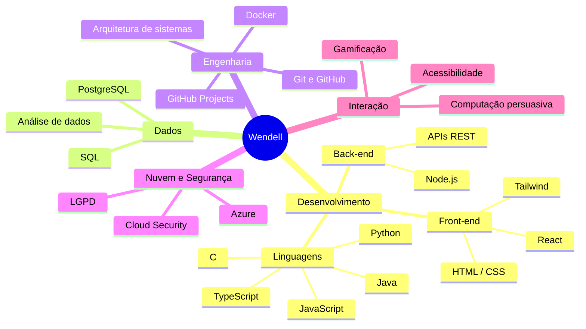
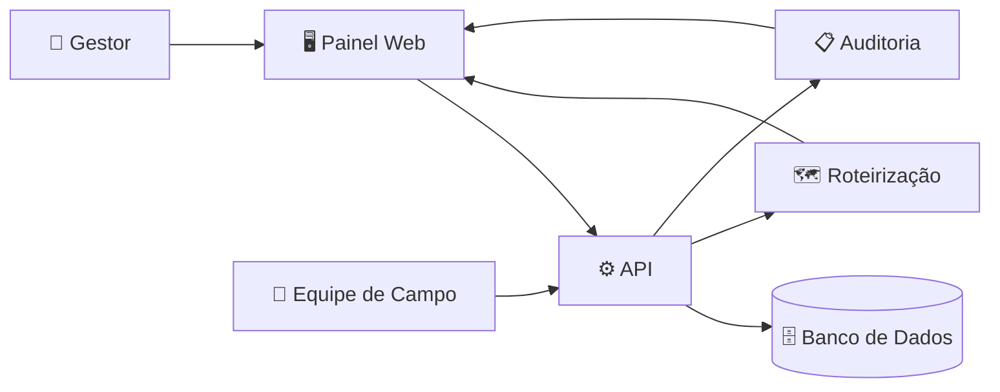
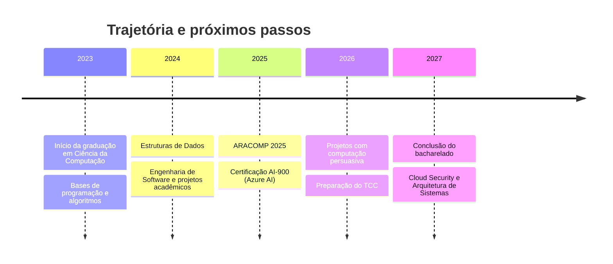

<!-- ═══════════════════════════════════════════════════════════════ -->
<!--                     README DE PERFIL — WENDELL SANTOS            -->
<!-- ═══════════════════════════════════════════════════════════════ -->

<div align="center">


<br/>

<a href="https://www.linkedin.com/in/wendellsanntos/"></a>
<a href="mailto:wendell.santos@ufal.br"></a>
<a href="https://ufal.br"></a>
<a href="https://github.com/WendellSantoss"></a>

<br/>


<br/>


</div>

<br/>

<div align="center">

### 🧭 Navegação rápida

[**👋 Sobre**](#-sobre-mim) &nbsp;•&nbsp;
[**⚡ Resumo**](#-resumo-rápido) &nbsp;•&nbsp;
[**🎓 Formação**](#-formação-acadêmica--certificações) &nbsp;•&nbsp;
[**💼 Experiência**](#-experiência-profissional) &nbsp;•&nbsp;
[**🛠️ Stack**](#️-tecnologias--ferramentas)

[**🧠 Competências**](#-mapa-de-competências) &nbsp;•&nbsp;
[**📌 Projetos**](#-projetos-em-destaque) &nbsp;•&nbsp;
[**🔬 Pesquisa**](#-pesquisa--interesses) &nbsp;•&nbsp;
[**🗺️ Roadmap**](#️-trajetória--roadmap) &nbsp;•&nbsp;
[**📊 Stats**](#-estatísticas--atividade)

[**🌎 Minha terra**](#-de-onde-eu-venho) &nbsp;•&nbsp;
[**🎲 Curiosidades**](#-curiosidades) &nbsp;•&nbsp;
[**🌐 Contato**](#-vamos-nos-conectar)

</div>


<!-- ═══════════════════════════ SOBRE ═══════════════════════════ -->

## 👋 Sobre mim

<table>
<tr>
<td width="62%" valign="top">

Olá! Eu sou o **Wendell**, estudante de **Ciência da Computação na Universidade Federal de Alagoas (UFAL), Campus Arapiraca**. Sou natural de **Penedo (AL)**, às margens do Rio São Francisco, e hoje moro em **Arapiraca**.

Acredito no **poder transformador da tecnologia** e busco aplicar os fundamentos da computação na resolução de problemas reais, unindo:

- 💻 **Desenvolvimento de software**: do front-end ao back-end
- 🏗️ **Arquitetura de sistemas**: projetar antes de codar
- 📊 **Análise de dados**: transformar dados em decisões
- ♿ **Acessibilidade**: tecnologia que inclui
- 🧠 **Computação persuasiva**: como sistemas influenciam comportamentos

Minha trajetória passa por **TI, suporte técnico, logística e administração**, o que me deu uma visão prática de como a tecnologia realmente funciona (e falha) no dia a dia das empresas.

</td>
<td width="38%" valign="top">

```yaml
👤 nome:        Wendell Santos
🌱 origem:      Penedo, AL
📍 mora_em:     Arapiraca, AL
🎓 curso:       Ciência da Computação
🏛️ instituição: UFAL (Arapiraca)
📅 período:     2023 – 2027
🔭 foco_atual:
   - Engenharia de Software
   - Estruturas de Dados
📚 aprendendo:
   - Arquitetura de Sistemas
   - Cloud Security
☕ combustível: café
🟢 status:      disponível
```

</td>
</tr>
</table>

<div align="center">

> 💡 ***"A melhor forma de prever o futuro é inventá-lo."*** — Alan Kay

</div>


<!-- ═══════════════════════════ RESUMO ═══════════════════════════ -->

## ⚡ Resumo rápido

<div align="center">

<table>
<tr>
<td align="center" width="20%"><h1>🎓</h1><b>Graduando</b><br/><sub>Ciência da Computação<br/>UFAL · 2023–2027</sub></td>
<td align="center" width="20%"><h1>🏆</h1><b>3 certificações</b><br/><sub>ARACOMP ×2<br/>Azure AI-900</sub></td>
<td align="center" width="20%"><h1>💼</h1><b>Experiência</b><br/><sub>TI · Logística<br/>Administrativo</sub></td>
<td align="center" width="20%"><h1>📌</h1><b>4 projetos</b><br/><sub>em destaque<br/>abaixo</sub></td>
<td align="center" width="20%"><h1>🚀</h1><b>Em busca de</b><br/><sub>estágio, pesquisa<br/>e colaborações</sub></td>
</tr>
</table>

</div>


<!-- ═══════════════════════════ FORMAÇÃO ═══════════════════════════ -->

## 🎓 Formação acadêmica & certificações

### 📚 Formação

| 🎓 Curso | 🏛️ Instituição | 📅 Período | 📍 Status |
|:---|:---|:---:|:---:|
| **Bacharelado em Ciência da Computação** | Universidade Federal de Alagoas, Campus Arapiraca | 2023 – 2027 | 🟢 Em andamento |

### 🏆 Certificações & eventos

<div align="center">

| | Certificação | Instituição | Área |
|:---:|:---|:---|:---:|
| 🏆 | **ARACOMP 2025**, Novidades Tecnológicas | Universidade Federal de Alagoas | Tecnologia |
| 🏆 | **ARACOMP 2025**, Mulheres na Área de Tecnologia | Universidade Federal de Alagoas | Diversidade |
| ☁️ | **AI-900**, Microsoft Azure AI Fundamentals | Fundação Bradesco | Cloud & IA |

</div>

<details>
<summary><b>📖 Disciplinas e áreas de estudo (clique para expandir)</b></summary>
<br/>

| Área | Tópicos |
|:---|:---|
| 🧮 **Fundamentos** | Algoritmos, lógica, estruturas de dados, complexidade |
| 🏗️ **Engenharia de Software** | Requisitos, processos ágeis, versionamento, GitHub Projects |
| 🗄️ **Dados** | Modelagem relacional, SQL, PostgreSQL, análise de dados |
| 🌐 **Web** | HTML, CSS, JavaScript, TypeScript, React, Node.js |
| 🛡️ **Redes & Segurança** | Redes de computadores, detecção de anomalias, Cloud Security |
| 🧠 **Interação & Comportamento** | Computação persuasiva, gamificação, acessibilidade |

</details>


<!-- ═══════════════════════════ EXPERIÊNCIA ═══════════════════════════ -->

## 💼 Experiência profissional

### 🏭 Impacto Bioenergia Alagoas S/A

Atuei em diferentes setores da empresa, construindo uma visão ampla de **operações, processos e tecnologia**.

<table>
<tr>
<td width="25%" valign="top" align="center">
<h3>🗂️</h3>
<b>Apoio Administrativo</b>
<br/><br/>
<sub>Rotinas administrativas e suporte às equipes</sub>
</td>
<td width="25%" valign="top" align="center">
<h3>📦</h3>
<b>Logística & Suprimentos</b>
<br/><br/>
<sub>Controle de estoque e pedidos de compra</sub>
</td>
<td width="25%" valign="top" align="center">
<h3>🖥️</h3>
<b>Suporte Técnico de TI</b>
<br/><br/>
<sub>Configuração e manutenção de dispositivos, diagnóstico de falhas e recuperação de dados</sub>
</td>
<td width="25%" valign="top" align="center">
<h3>📝</h3>
<b>Documentação Técnica</b>
<br/><br/>
<sub>Relatórios técnicos com foco em conformidade com a <b>LGPD</b></sub>
</td>
</tr>
</table>

<details>
<summary><b>🎯 O que essa experiência me ensinou</b></summary>
<br/>

- 🔧 **Diagnóstico de problemas**: investigar a causa raiz antes de aplicar a solução
- 📋 **Organização e processos**: controle de estoque exige método e atenção a detalhes
- 🔐 **Cuidado com dados**: trabalhar com foco em LGPD muda a forma de pensar sistemas
- 🤝 **Comunicação**: explicar problemas técnicos para quem não é de tecnologia
- 🧩 **Visão sistêmica**: entender como TI, logística e administração se conectam

</details>


<!-- ═══════════════════════════ STACK ═══════════════════════════ -->

## 🛠️ Tecnologias & ferramentas

<div align="center">

### 💻 Linguagens


### 🌐 Web: Front-end & Back-end


### 🗄️ Dados & infraestrutura


### 🧰 Ambientes & ferramentas


<br/>

### ✨ Visão geral em ícones


</div>

<details>
<summary><b>🔎 Como eu uso cada tecnologia</b></summary>
<br/>

| Tecnologia | Uso |
|:---|:---|
| 🐍 **Python** | Algoritmos, scripts, análise de dados |
| ☕ **Java** | Programação orientada a objetos e projetos acadêmicos |
| ⚙️ **C** | Fundamentos, estruturas de dados, baixo nível |
| 🟨 **JavaScript / TypeScript** | Aplicações web e protótipos |
| ⚛️ **React** | Interfaces componentizadas |
| 🟩 **Node.js** | APIs e back-end |
| 🐘 **PostgreSQL / SQL** | Modelagem e consultas |
| 🐳 **Docker** | Ambientes reproduzíveis |
| ☁️ **Azure** | Fundamentos de IA e nuvem |
| 🎨 **Figma** | Protótipos e design de interface |
| 📮 **Postman** | Teste de APIs |

</details>


<!-- ═══════════════════════════ COMPETÊNCIAS ═══════════════════════════ -->

## 🧠 Mapa de competências



<div align="center">

### 🎯 Soft skills


</div>


<!-- ═══════════════════════════ PROJETOS ═══════════════════════════ -->

## 📌 Projetos em destaque

<table>
<tr>
<td width="50%" valign="top">

<h3>♿ Tradução Visual Acessível</h3>

<p>Protótipo de <b>visão computacional</b> para leitura e extração de textos de quadros brancos em sala de aula, com foco em <b>acessibilidade</b>.</p>

<p>


</p>

<p><b>🎯 Objetivo:</b> tornar o conteúdo de sala de aula mais acessível.</p>

[](https://github.com/WendellSantoss)

</td>
<td width="50%" valign="top">

<h3>🚚 GeniOS — ERP Operacional de Serviços de Campo</h3>

<p>Sistema ERP para <b>roteirização, logística e auditoria</b> de serviços de campo, desenvolvido como projeto acadêmico de Engenharia de Software.</p>

<p>


</p>

<p><b>🎯 Objetivo:</b> organizar rotas, logística e auditoria em uma só plataforma.</p>

[](https://github.com/WendellSantoss)

</td>
</tr>

<tr>
<td width="50%" valign="top">

<h3>🏃 Computação Persuasiva — Corrida Gamificada</h3>

<p>Análise do aplicativo <b>Zepp</b> e de seus elementos de <b>gamificação</b> e <b>computação persuasiva</b> aplicados ao acompanhamento de treinos de corrida.</p>

<p>


</p>

<p><b>🎯 Objetivo:</b> entender como apps influenciam hábitos de treino.</p>

[](https://github.com/WendellSantoss)

</td>
<td width="50%" valign="top">

<h3>🛡️ Detecção e Análise de Anomalias em Redes</h3>

<p>Proposta de <b>sistema inteligente</b> para identificação e análise de comportamentos anômalos em redes de computadores.</p>

<p>


</p>

<p><b>🎯 Objetivo:</b> detectar comportamentos suspeitos em tráfego de rede.</p>

[](https://github.com/WendellSantoss)

</td>
</tr>
</table>

<div align="center">

[](https://github.com/WendellSantoss?tab=repositories)

</div>

<!--
  DICA: depois de ter os nomes exatos dos repositórios, você pode usar cards "pin" dinâmicos:

  <a href="https://github.com/WendellSantoss/NOME-DO-REPO">
    
  </a>
-->

<details>
<summary><b>🧩 Arquitetura de exemplo: GeniOS (visão conceitual)</b></summary>
<br/>



> Diagrama conceitual ilustrativo. Ajuste conforme a arquitetura real do projeto.

</details>


<!-- ═══════════════════════════ PESQUISA ═══════════════════════════ -->

## 🔬 Pesquisa & interesses

<table>
<tr>
<td width="33%" valign="top" align="center">
<h3>🧠</h3>
<b>Computação Persuasiva</b>
<br/><br/>
<sub>Como o design de sistemas e aplicativos pode influenciar atitudes e comportamentos, incluindo gamificação e motivação.</sub>
</td>
<td width="33%" valign="top" align="center">
<h3>♿</h3>
<b>Acessibilidade</b>
<br/><br/>
<sub>Visão computacional e tecnologia assistiva para tornar ambientes de aprendizagem mais inclusivos.</sub>
</td>
<td width="33%" valign="top" align="center">
<h3>🛡️</h3>
<b>Redes & Segurança</b>
<br/><br/>
<sub>Detecção de anomalias, análise de dados de rede e fundamentos de Cloud Security.</sub>
</td>
</tr>
</table>


<!-- ═══════════════════════════ ROADMAP ═══════════════════════════ -->

## 🗺️ Trajetória & roadmap



<div align="center">

### 🎯 Metas atuais

</div>

- [x] Ingressar em Ciência da Computação na UFAL
- [x] Participar da ARACOMP 2025
- [x] Conquistar a certificação Azure AI-900
- [x] Desenvolver projetos acadêmicos de Engenharia de Software
- [ ] Aprofundar Estruturas de Dados e Algoritmos
- [ ] Estudar Arquitetura de Sistemas
- [ ] Avançar em Cloud Security
- [ ] Conquistar um estágio na área de tecnologia
- [ ] Concluir o bacharelado em 2027


<!-- ═══════════════════════════ ESTATÍSTICAS ═══════════════════════════ -->

## 📊 Estatísticas & atividade

<div align="center">


<br/>


<br/>


<br/>


</div>

<!--
  ANIMAÇÃO "SNAKE" (opcional): exige uma GitHub Action no repositório do perfil
  (ex.: Platane/snk). Depois de configurar, descomente:

  <div align="center">
    
  </div>
-->


<!-- ═══════════════════════════ MINHA TERRA ═══════════════════════════ -->

## 🌎 De onde eu venho

<table>
<tr>
<td width="60%" valign="top">

### 🌊 Penedo, Baixo São Francisco (AL)

Sou natural de **Penedo**, cidade histórica às margens do **Rio São Francisco**, o quarto maior rio do Brasil e da América do Sul, que faz a divisa entre **Alagoas e Sergipe**.

Hoje moro em **Arapiraca**, onde curso Ciência da Computação no campus da **UFAL**. Carrego comigo o orgulho de ser alagoano e a vontade de mostrar que dá para fazer tecnologia de qualidade aqui no Nordeste. 💙

</td>
<td width="40%" valign="top">

```text
   ~ ~ ~ ~ ~ ~ ~ ~ ~ ~ ~ ~ ~
  ~  Rio São Francisco  ~
   ~ ~ ~ ~ ~ ~ ~ ~ ~ ~ ~ ~ ~
      Penedo ──► Arapiraca
        AL   ──►    AL
   "de beira de rio ao código"
```

</td>
</tr>
</table>


<!-- ═══════════════════════════ CURIOSIDADES ═══════════════════════════ -->

## 🎲 Curiosidades

<details open>
<summary><b>✨ Alguns fatos sobre mim</b></summary>
<br/>

- ☕ Programo melhor com café por perto
- 🏃 Também me interesso por corrida e acompanho meus treinos por aplicativo
- 🌱 Estou sempre aprendendo algo novo
- 🧩 Gosto de desafios de algoritmos e problemas acadêmicos
- 🌊 Sou de Penedo, uma cidade às margens do Velho Chico
- 🤝 Adoro trocar ideias sobre tecnologia em Alagoas

</details>

<div align="center">

### 💬 Pergunte-me sobre


</div>


<!-- ═══════════════════════════ CONTATO ═══════════════════════════ -->

## 🌐 Vamos nos conectar?

<div align="center">

Gosto de trocar ideias sobre tecnologia, **oportunidades de estágio/trabalho**, **projetos de pesquisa** ou simplesmente bater um papo sobre programação e café ☕.

<br/>

<a href="https://www.linkedin.com/in/wendellsanntos/"></a>
<a href="mailto:wendell.santos@ufal.br"></a>
<a href="https://ufal.br"></a>
<a href="https://github.com/WendellSantoss"></a>

<br/><br/>

| 📬 Canal | 🔗 Link |
|:---:|:---:|
| **LinkedIn** | [linkedin.com/in/wendellsanntos](https://www.linkedin.com/in/wendellsanntos/) |
| **E-mail** | [wendell.santos@ufal.br](mailto:wendell.santos@ufal.br) |
| **GitHub** | [github.com/WendellSantoss](https://github.com/WendellSantoss) |

<br/>


<br/>

📐 ***"A melhor forma de prever o futuro é inventá-lo."*** — Alan Kay

</div>


